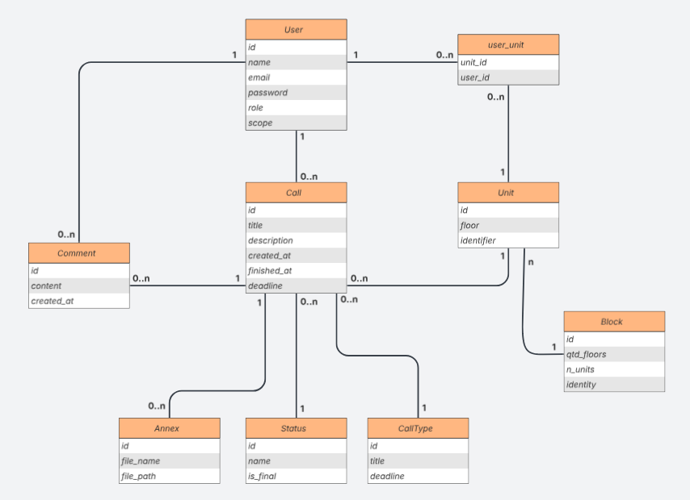
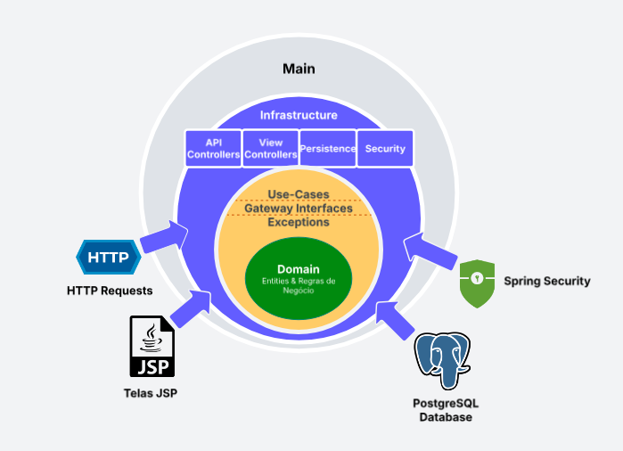

# Chamados Condomínio

O seguinte projeto foi desenvolvido com o objetivo de gerenciar chamados em um ambiente de condomínio, permitindo o controle de usuários, unidades, tipos de manutenção e fluxo de atendimento.

---

## 📌 Visão Geral

O sistema permite que moradores registrem chamados relacionados a problemas em suas unidades, enquanto colaboradores e administradores gerenciam o atendimento dessas solicitações.

A aplicação foi projetada considerando cenários reais de condomínios, incluindo controle de acesso, escopo de atuação e rastreabilidade das interações.

---

## 🧱 Estrutura do Sistema

O sistema é composto pelas seguintes entidades principais:

* **User**
* **Block**
* **Unit**
* **Call**
* **Annex**
* **Status**
* **CallType**
* **Comment**

Essas entidades representam os elementos essenciais para o funcionamento do fluxo de chamados.

---

## 📜 Regras de Negócio

- Um usuário possui uma role: **ADMIN**, **COLLABORATOR** ou **RESIDENT**
- Um usuário pode estar vinculado a uma ou mais unidades
- Uma unidade pode ter um ou mais usuários vinculados
- Um residente só pode visualizar chamados:
  - criados por ele
  - ou vinculados às suas unidades
- Um colaborador só pode acessar chamados dentro do seu escopo
- Um chamado sempre inicia com um status padrão (**Open**)
- Usuários podem aplicar filtros de listagem aos chamados
- Apenas **ADMIN** e **COLLABORATORS** no escopo podem alterar o status
- Adminstradores podem vincular usuários a unidades
- Chamados com status final:
  - são encerrados automaticamente
  - não podem mais ser modificados
- Chamados podem ser feitos selecionando uma de suas unidades
- Comentários respeitam regras de escopo e autoria
- Unidades são geradas automaticamente a partir da criação de blocos

---

## 👥 Perfis de Usuário

### 🔹 Resident (Morador)

* Pode visualizar apenas chamados:
  * criados por ele
  * ou relacionados à unidade em que reside
* Pode:
  * Criar novos chamados
  * Anexar arquivos (opcional)
  * Visualizar detalhes
  * Comentar em seus próprios chamados

---

### 🔹 Collaborator (Colaborador)

* Possui um **escopo de atuação** (ex: Elétrica, Hidráulica)
* Pode visualizar apenas chamados do seu escopo
* Pode:
  * Visualizar detalhes
  * Comentar nos chamados
  * Filtrar por status
  * Alterar status

---

### 🔹 Admin (Administrador)

Possui controle total do sistema:

* Gerenciamento de usuários (CRUD)
* Gerenciamento de blocos e unidades
* Vinculação de usuários às unidades
* Criação de:
  * Tipos de chamado
  * Status
* Visualização completa dos chamados
* Pode comentar e alterar qualquer chamado

---

## 🏢 Gestão de Estrutura do Condomínio

Administradores podem criar blocos informando:

* Identificação (ex: A, B, Sul)
* Quantidade de andares
* Número de unidades por andar

### 📐 Regra de geração de unidades

Exemplo:

* 3 andares
* 5 unidades por andar

Resultado:

* Térreo: 001, 002, 003...
* 1º andar: 101, 102, 103...
* 2º andar: 201, 202, 203...

A geração é automática e segue um padrão consistente de identificação.

---

## 📞 Fluxo de Chamados

### 🔹 Criação

Ao criar um chamado, o usuário informa:

* Título
* Unidade
* Tipo de chamado
* Descrição
* Anexos (opcional)

O chamado inicia com status padrão: **Open**

---

### 🔹 Tipos de Chamado (CallType)

* Definidos por administradores
* Possuem:
  * Título
  * Deadline (SLA em horas)

Exemplo:

* SLA = 4.5 → 4h30min

O sistema calcula automaticamente o prazo do chamado com base no horário de criação.

---

### 🔹 Status

* Criados por administradores
* Possuem flag de **status final**

Quando um chamado atinge um status final:

* É encerrado automaticamente
* Recebe data de finalização
* Não pode mais ser alterado

---

### 🔹 Comentários

* Funcionam como histórico de interações
* Regras:
  * Resident: apenas nos próprios chamados
  * Collaborator: apenas no seu escopo
  * Admin: em todos

---

## 🔐 Controle de Acesso

Implementado com **Spring Security**, baseado em roles:

* ADMIN
* COLLABORATOR
* RESIDENT

Regras principais:

* Rotas protegidas por perfil no `SecurityConfig`
* Restrições adicionais por escopo aplicadas na aplicação
* Redirecionamentos:
  * Não autenticado → login
  * Sem permissão → página 403

---

## 🧠 Decisões Arquiteturais

O sistema segue princípios de **Clean Architecture**, garantindo separação de responsabilidades e facilidade de manutenção.

### 🔹 Camadas

* **Domain**
  * Entidades e regras de negócio

* **Application**
  * Use cases
  * Gateways (interfaces)
  * Exceções de negócio

* **Infrastructure**
  * Controllers (View e API)
  * Implementações de repositório
  * Mapeamentos (Entity ↔ Domain)
  * Segurança (Spring Security)
  * Persistência (JPA)

* **Main**
  * Configuração de beans
  * Inicialização da aplicação

---

### 🔹 Interface

* Utilização de **JSP (Java Server Pages)**
* Responsável pela renderização das telas

---

### 🔹 Controllers

* Separação entre:
  * **View Controllers** → renderizam páginas JSP
  * **API Controllers** → endpoints REST (`/api`)

---

### 🔹 Persistência

* Banco de dados: **PostgreSQL**
* Acesso via JPA (Hibernate)
* Versionamento com **Flyway**

As migrations são responsáveis por:

* Criação das tabelas
* Evolução do schema
* Inserção de dados iniciais

---

### 🔹 Usuário Inicial

Criado automaticamente via migration:

* Email: `ryan@gmail.com`
* Senha: `ryan123`
* Perfil: ADMIN

---

## 🗄️ Diagrama do Banco de Dados

<p align="center">
  
</p>

---

## 🏗️ Arquitetura do Sistema

<p align="center">
  
</p>

---

## 🚀 Como Executar o Projeto

### 🔹 Pré-requisitos

* Docker
* Docker Compose

---

### 🔹 Execução

```bash
docker compose up
```

### 🔹 Acesso
```bash
http://localhost:8080
```


---

### 🔹 Fluxo de Acesso

- Usuário não autenticado → redirecionado para login
- Usuário sem permissão → página 403

---

## ⭐ Diferenciais

- Arquitetura baseada em **Clean Architecture**
- Separação entre API e View Controllers
- Controle de acesso por **role + escopo**
- Execução simplificada com `docker compose up`

---

## ⚠️ Observações Importantes

- Migrations são imutáveis após execução
- Controle de acesso centralizado no Spring Security
- Sistema projetado com base em cenários reais de uso

---

## 📌 Considerações Finais

O sistema foi desenvolvido com foco em:

- Organização
- Segurança
- Escalabilidade
- Clareza na separação de responsabilidades

As decisões arquiteturais adotadas permitem fácil manutenção, evolução e adaptação do sistema a novos requisitos.